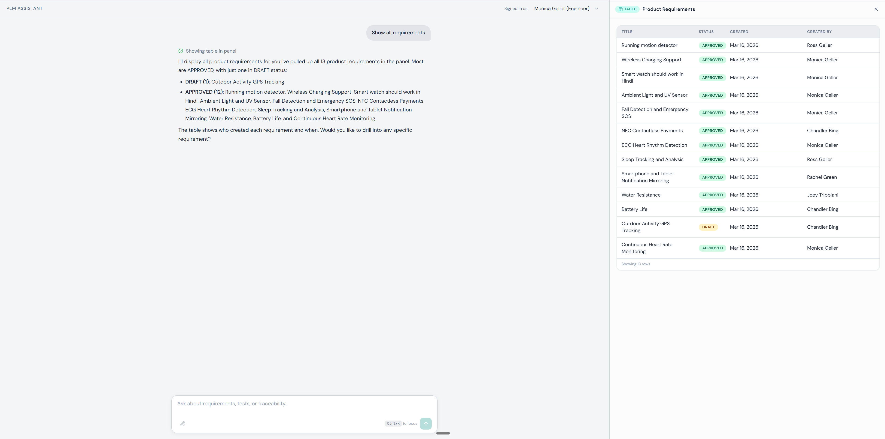
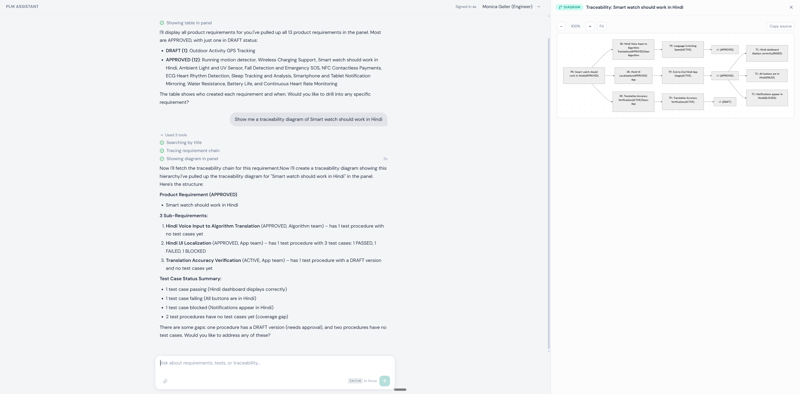

# PLM - Product Lifecycle Management

A chat-based tool for managing product requirements, test procedures, and test cases. Instead of clicking through menus and forms, you just type what you need and the AI handles the rest.

**Try it:** [plm-app.vercel.app](https://plm-app.vercel.app)



*Chat interface with product requirements table in the side panel*



*Traceability diagram generated from a product requirement*

## Why This Exists

The biggest pain with traditional lifecycle management tools is the clicking. Creating a requirement, approving it, writing test procedures, recording results - every action means navigating through multiple screens. Nobody wants to do it, and things fall behind.

PLM replaces all of that with a chat interface. You type "create a requirement for battery life testing" and it does it. You type "what did Ross work on last week?" and it pulls from the audit log. You get up-to-date context in 25 seconds instead of clicking through 10 screens.

**Nothing gets updated without your confirmation.** Every change the AI proposes, you approve first. The idea is to build trust in this model and eventually move toward more automation - like parsing test procedures and generating test cases automatically.

### Why it's worth considering

1. **Cost** - Total build cost is under $400 (API costs + hosting). Way cheaper than any commercial PLM tool.
2. **Customizable** - The lifecycle rules are yours. Change them whenever you need to, no vendor lock-in.
3. **No training needed** - Users just type. Even someone from production can update a test case or procedure without learning a new interface.

## What's Built

### Core System
- Full entity hierarchy: Product Requirements, Sub-Requirements, Test Procedures (with versioning), and Test Cases
- PostgreSQL database with lifecycle enforcement, audit logging, and data integrity constraints
- Domain command API (not generic CRUD) - each endpoint maps to one business action

### AI Chat Interface
- Natural language interface powered by Claude (41 tools for creating, updating, querying, and managing entities)
- Confirm-before-act on all destructive operations (cancel, re-parent, reactivate, correct results)
- Context panel that shows entity details, data tables, traceability diagrams, and audit logs
- Drag-to-resize panel, keyboard shortcuts (Cmd+K to focus, Cmd+\ to toggle panel)

### Lifecycle Management
- Full status lifecycle: Draft, Active, Approved, Canceled, with enforced transition rules
- Edit controls: Draft entities fully editable, Approved entities allow limited edits (audited)
- Cancel with cascade (children get canceled too), reactivate with cascade (children come back)
- Re-parent: move sub-requirements or test procedures to a different parent
- Test case recovery: correct wrong results, re-execute failed tests, update notes

### Audit & Traceability
- Every mutation logged with user, timestamp, source (chat vs API), and change details
- AI can summarize audit activity ("what did Chandler do this week?")
- Mermaid traceability diagrams generated on demand
- Cross-entity queries: coverage by team, test result summaries, gap analysis

## What's Missing (Known Limitations)

- **No real authentication** - 6 demo users (the cast of Friends) are hardcoded. You pick a user from a dropdown. Real sign-in with email/password or OAuth is planned (#62).
- **No permissions** - All users see all data and can do everything. Role-based access control (admin, editor, commenter) scoped by team is planned (#63).
- **No file attachments** - The data model supports attachments, but there's no upload UI yet.

## Demo Users

The app ships with a smartwatch PLM dataset and 6 demo users. Switch users from the dropdown in the top-right corner.

| User | Team |
|------|------|
| Monica Geller | Hardware |
| Ross Geller | Algorithm |
| Rachel Green | App |
| Chandler Bing | Electrical |
| Joey Tribbiani | Mechanical |
| Phoebe Buffay | Testing |

## What's Coming

- **User authentication** - Sign in with email/password or OAuth, replacing the demo user picker (#62)
- **Role-based permissions** - Admin, editor, and commenter roles scoped by team (#63)
- **Team data isolation** - Scope queries so users only see their team's data (#32)
- **AI observability** - Structured logging and tracing for model inputs, outputs, and decisions (#64)
- **AI evals** - Automated tests for AI response quality and recurring error detection (#65)
- **AI maintenance** - Plan for model upgrades, prompt tuning, and data drift (#66)
- **Frontend resilience** - Error boundaries and retry logic
- **Human-readable IDs** - Short IDs instead of UUIDs (e.g., PR-001)
- **Document parsing** - Upload PDFs or Word docs and extract requirements automatically

## Journey

This project started as a learning exercise and grew into a working system. Here's how it came together.

### Phase 1: Foundation

The first question was: what does a PLM system actually need? The answer was a hierarchy - Product Requirements break down into Sub-Requirements, which get verified by Test Procedures (with immutable version snapshots), which produce Test Cases. Every action in the system is a business command ("approve this requirement") rather than a generic database operation ("update row where id = ..."). This was the most important early decision - it made every feature after this easier to build.

The database, API routes, and service layer all went in together. Services own the lifecycle rules and run everything inside database transactions with audit logging. If something fails halfway through, nothing gets saved. If something succeeds, there's a record of who did it and when.

### Phase 2: The AI Layer

Next came the chat interface. The AI has 41 tools - it can create entities, approve them, run queries, show diagrams, and manage attachments. The key decision here was having the AI call the service layer directly instead of going through HTTP routes. This avoided a whole class of problems (auth headers, self-round-trips, error handling duplication).

The confirm-before-act pattern was simple but important: the system prompt tells the AI to always ask before making changes, and the tool schemas enforce it with a required `confirmed: true` field. No complex middleware needed.

### Phase 3: Making It Look Right

The UI went through two major redesigns. The first version looked dated - it worked but nobody would want to use it. The fix was to stop guessing at design and start with a spec: research real products, pick explicit colors and fonts, define spacing rules. The current design uses a slate+teal palette with frosted glass surfaces, DM Sans for text, and a resizable side panel for rich context views.

One lesson learned the hard way: a global CSS reset (`* { margin: 0; padding: 0 }`) was silently breaking every Tailwind spacing utility. Removing two lines of CSS fixed dozens of layout issues.

### Phase 4: Hardening

Security, performance, and edge cases. Rate limiting on the chat endpoint (protects the API budget). Security headers. XSS protection on rendered markdown. A separate test database so tests don't pollute dev data.

The Mermaid diagram rendering had two separate bugs - first the diagrams were too small (a CSS constraint forced them into a tiny space), then the text labels disappeared (the HTML sanitizer was stripping the SVG elements that Mermaid uses for text). Both required understanding how the libraries actually work under the hood.

### Phase 5: Real Lifecycle Operations

This is where PLM became genuinely useful. Editing approved entities (with restrictions and audit trails). Canceling with cascade (cancel a requirement and all its children get canceled too). Reactivating canceled entities (the reverse of cascade cancel). Re-parenting (move a sub-requirement to a different parent requirement). Correcting test results after the fact.

Each of these features built on the patterns established in Phase 1 - domain commands, service-layer enforcement, audit logging in transactions, confirm-before-act. The early architecture decisions paid off because none of these features required reworking the foundation.

### Phase 6: Testing and Validation

The system has 161+ automated tests covering lifecycle transitions, schema validation, service logic, and panel payloads, all running against an isolated test database. Beyond automated tests, real-life scenario tests walk through multi-user workflows end to end - multiple users creating, approving, canceling, recovering, and re-parenting entities across teams. A headless browser QA setup captures screenshots and checks that the UI actually renders what the code says it should. Manual database integration walkthroughs verify the full stack from chat input to database state.

### Key Decisions That Shaped the System

| Decision | Why |
|----------|-----|
| Domain commands over CRUD | Every API call has clear business intent - easier to audit, test, and extend |
| Services own transactions | No partial writes, no orphaned data, audit log always consistent |
| AI calls services directly | Avoids self-round-trips through HTTP, simpler error handling |
| Confirm-before-act via prompt + schema | Works with zero middleware - just a system prompt rule and a Zod field |
| Two-entity versioning | Test procedures evolve while past versions stay immutable |
| Exclusive arc for attachments | Polymorphic ownership with database-enforced constraints |
| Spec-driven UI design | Explicit hex values and spacing rules instead of "make it look better" |

---

## How Do AI Products Work?

Building an AI product is more than picking a model and calling an API. There are four things you need to get right, and they build on each other.

### 1. Context Engineering - Done

The model only knows what you show it. Context engineering is figuring out what information the model needs to see - and in what format - to produce useful outputs. This includes the system prompt (background instructions), the conversation history, tool descriptions, and any data you pull from the database to include in the request.

In PLM, the system prompt gives the model its role, the lifecycle rules, and guidance on when to confirm before acting. Every tool has a description that tells the model when and how to use it. When the model calls a tool, the result (formatted data from the database) becomes part of the context for its next response. Getting this right is the difference between an AI that fumbles through tasks and one that handles them confidently.

### 2. Orchestration - Done

Orchestration is how you sequence model calls, combine their outputs, and handle failures. A single user message might trigger multiple tool calls - the model reads a requirement, checks its status, finds related test procedures, and then summarizes everything. You need to decide: does the model handle all of this in one turn, or do you break it into steps? What happens if a tool call fails halfway through?

In PLM, the model handles orchestration itself through the Vercel AI SDK's multi-step tool calling. It can chain up to 25 tool calls in a single response, deciding on its own which tools to call and in what order. The confirm-before-act pattern is part of orchestration too - the model proposes a change, waits for the user to confirm, then executes it.

### 3. Observability - Planned (#64)

Once the AI is running, you need to see what it's doing. Observability means logging the model's inputs, outputs, and decision path so you can understand why it gave a particular answer or made a particular tool call. Without this, debugging AI behavior is guesswork.

PLM currently has a basic trace logger for development, but no structured way to inspect conversations after the fact. The next step is proper logging and tracing that captures every model interaction in a reviewable format.

### 4. Evals and Maintenance - Planned (#65, #66)

Evals are automated tests for AI behavior - they detect recurring errors and measure quality over time. Unlike regular unit tests (which check if code runs correctly), evals check if the AI's responses are actually good. Does it use the right tool? Does it ask for confirmation before destructive actions? Does it give accurate answers about entity status?

Maintenance is the ongoing work of keeping the system reliable as models get updated and real-world usage patterns change. A new model version might handle prompts differently. Users might ask questions the system wasn't designed for. You need a plan for prompt tuning, model upgrades, and monitoring for drift.

**Where PLM stands today:** Context engineering and orchestration are built and working. Observability, evals, and maintenance are the remaining pieces to make this a complete AI product.

---

## For Developers

### Tech Stack

- **Framework**: Next.js 16 (App Router, TypeScript)
- **Database**: Neon PostgreSQL via Prisma ORM
- **AI**: Vercel AI SDK v6 + Anthropic Claude (streaming chat with 41 LLM tools)
- **UI**: Tailwind CSS v4, Zustand, react-markdown, lucide-react, mermaid
- **Validation**: Zod schemas (shared between API routes and LLM tools)
- **Testing**: Vitest (isolated test database)
- **Auth**: Demo users via Edge Middleware (V1)
- **Security**: Rate limiting (chat endpoint, kill switch via env var), security headers, HTML stripping, UUID validation, generic error responses (no DB detail leakage), robots.txt

### Quick Start

```bash
# Install dependencies
npm install

# Set up environment
cp .env.local.example .env.local
# Add your Neon DATABASE_URL and ANTHROPIC_API_KEY to .env.local
# Also create .env with just DATABASE_URL (Prisma CLI needs this)
# For tests: create .env.test with DATABASE_URL pointing to a separate test database

# Set up database (uses migration with custom SQL constraints)
npx prisma migrate deploy

# Seed demo data
npx prisma db seed

# Start dev server
npm run dev
```

### API Design

The API uses **domain commands** instead of raw CRUD. Each endpoint maps to one business action:

```
POST /api/product-requirements/create
POST /api/product-requirements/:id/approve
POST /api/product-requirements/:id/cancel
GET  /api/product-requirements
GET  /api/product-requirements/:id
```

#### Entity Hierarchy

```
ProductRequirement (org-wide)
  -> SubRequirement (team-assigned)
    -> TestProcedure (logical container)
      -> TestProcedureVersion (immutable snapshots, one draft at a time)
        -> TestCase (execution records)
```

#### Chat API (LLM)

```
POST /api/chat   # Streaming natural language interface to manage PLM entities
```

Send `{ messages: [{ role, content }] }` with `x-demo-user-id` header. Returns a Vercel AI SDK stream. The LLM has 41 tools (24 mutation, 5 read, 4 query, 4 UI intent, 2 attachment) and confirms before destructive actions.

### Scripts

```bash
npm run dev          # Start dev server
npm run build        # Production build
npm run test         # Run tests (229 tests, uses .env.test database)
npm run test:watch   # Watch mode
npm run lint         # ESLint
```

### Project Structure

```
src/
  app/               # Next.js pages + API routes
    api/             # 38 route handlers (domain commands + queries + chat)
    page.tsx         # Chat UI (dual-panel, streaming)
    globals.css      # Tailwind v4 + design tokens
  components/chat/   # Chat UI components (8 files)
  components/panel/  # Context panel views (detail, table, diagram, audit, error)
  hooks/             # Shared React hooks (useDesktopBreakpoint)
  stores/            # Zustand stores (panel state + width)
  types/             # Shared TypeScript types + Zod schemas (panel payloads)
  lib/ai/            # LLM layer: system prompt, 41 tools, trace logger
  lib/               # Shared utilities (prisma, errors, auth, demo-users)
  schemas/           # Zod validation schemas
  services/          # Business logic with lifecycle enforcement + audit logging
  __tests__/         # Vitest tests (lifecycle, schema, integration, panel)
prisma/
  schema.prisma      # Database schema (9 models, 7 enums)
  seed.ts            # Demo data seeder
docs/
  DATABASE.md        # Schema documentation and seed data
  STATUS-GUIDE.md    # Lifecycle status reference
  USER-GUIDE.md      # End-user guide
  design/            # Design specs and HTML prototype
  archive/           # Completed audits and investigations
```

### Documentation

- [USER-GUIDE.md](docs/USER-GUIDE.md) - What the app does, how to use the chat, example prompts
- [ROADMAP.md](ROADMAP.md) - V1 summary, V2/V3 planned features
- [STATUS-GUIDE.md](docs/STATUS-GUIDE.md) - Full lifecycle status reference
- [DATABASE.md](docs/DATABASE.md) - Schema documentation and seed data

---

## Issue Log

| Issue | Description | Status |
|-------|-------------|--------|
| #3 | Project foundation + database | Done |
| #4 | LLM backend - 25 tools + streaming chat endpoint | Done |
| #5 | Chat UI - single-panel streaming chat | Done |
| #6 | Context panel - tables, diagrams, detail views | Done |
| #7 | UI redesign + demo data | Done |
| #8 | Database hardening (partial unique indexes, check constraints) | Done |
| #11 | Audit log viewer in context panel | Done |
| #12 | Fix panel not opening on UI intent tool calls | Done |
| #13 | Warm earthy beige palette refresh | Done |
| #16 | Rename status enums for clarity | Done |
| #17 | Test database isolation | Done |
| #19 | Migration drift reset | Done |
| #20 | UI redesign - slate+teal palette, drag-to-resize, keyboard shortcuts | Done |
| #21 | Deploy + README rewrite | Done |
| #22 | Security audit - rate limiting, headers, XSS hardening | Done |
| #23 | Usable Mermaid diagrams - zoom controls, compact syntax | Done |
| #24 | Cross-entity panel data - enriched queries, aggregations | Done |
| #25 | Match UI to prototype pixel-perfect | Done |
| #26 | Full-stack audit - 11 quick fixes | Done |
| #27 | Documentation overhaul | Done |
| #29 | Cascade cancellation | Done |
| #30 | Chat endpoint hardening - streaming error recovery | Done |
| #31 | Audit source threading - chat vs API | Done |
| #33 | LLM attachment tools + CANCELED parent validation | Done |
| #35 | Configurable AI model via env var | Done |
| #38 | Mermaid diagram text labels fix | Done |
| #42 | Show attachments in entity detail panel | Done |
| #48 | Lifecycle editing - DRAFT/APPROVED edits, cancellation | Done |
| #49 | Test case recovery - correct, re-execute, update notes | Done |
| #50 | Re-parenting - move SRs/TPs to different parents | Done |
| #51 | Manual DB integration walkthrough | Done |
| #54 | Reactivate canceled entities with cascade | Done |
| #56 | Show thinking phrases during tool execution | Done |
| #59 | Confirm buttons appear only after streaming completes | Done |
| #60 | Duplicate React key fix in message-list | Done |
| #57 | AI misinterprets conversational cancel as domain command | Open |
| #58 | Reactivation does not clear previous test result | Open |
| #61 | Test: edit SKIPPED TC and re-parent CANCELED entity | Open |
| #9 | Document parsing pipeline - PDF, Word, URL | Planned |
| #10 | V2 panel features - clickable rows, history, inline editing | Done |
| #32 | Team data isolation | Planned |
| #34 | Frontend resilience - error boundaries, retry | Planned |
| #37 | Human-readable short IDs | Planned |
| #62 | User authentication - email/password + OAuth | Planned |
| #63 | Role-based permissions - admin, editor, commenter | Planned |
| #64 | AI observability - logging and tracing | Planned |
| #65 | AI evals - automated quality testing | Planned |
| #66 | AI maintenance - model updates and data drift | Planned |

---

## License

[MIT](LICENSE)
